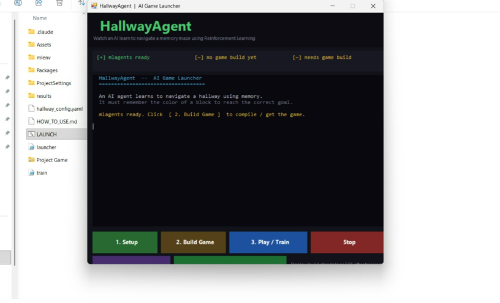

# Hallway Agent (Unity ML-Agents)

## Overview
This project implements a reinforcement learning agent using Unity ML-Agents.
The agent learns to navigate a hallway and reach the correct goal based on color.

## Setup Instructions
1. Open project in Unity Hub
2. Install ML-Agents (version 0.29 recommended)
3. Open SampleScene
4. Press Play

## How to Train
Run:
mlagents-learn config.yaml --run-id=run1

Then press Play in Unity.

## How to Run
Use trained model or press Play for inference.

## Agent Logic
- Observes environment using raycasts
- Identifies color block
- Moves toward correct goal
- Reward system:
  +1 correct goal
  -0.1 wrong goal
  small negative per step

## Demo
## 📸 Screenshots

